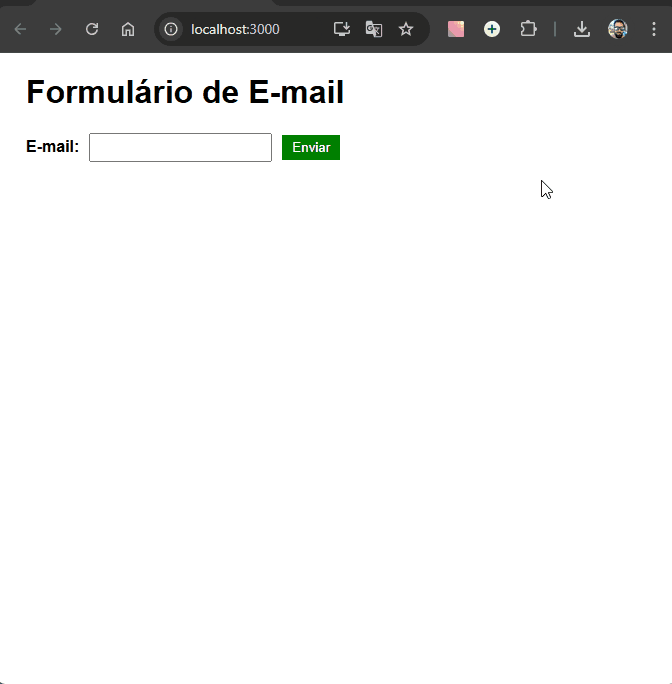

# Formulário com Validação de E-mail

Desenvolvido como exercício prático para aprender e aplicar conceitos de componentes, eventos e validação de formulários em React.

Este projeto implementa um formulário com campo de e-mail em React, utilizando as bibliotecas **Formik** e **Yup** para gerenciar o estado do formulário e realizar a validação do campo de e-mail. A validação é feita em tempo real, fornecendo feedback imediato ao usuário sobre o preenchimento correto ou incorreto do e-mail.



## Tecnologias Utilizadas

- **React**
- **Formik** - para gerenciar o estado e as submissões do formulário
- **Yup** - para validação de esquema do e-mail

## Estrutura de Pastas

```
📦 formulario-com-react
 ┣ 📂 node_modules
 ┃ ┗ 📜 ...
 ┣ 📂 public
 ┃ ┣ 📜 index.html
 ┃ ┗ 🖼️ favicon.ico
 ┣ 📂 src
 ┃ ┣ 📜 App.js
 ┃ ┣ 📜 FormularioEmail.js
 ┃ ┣ 📜 index.css
 ┃ ┗ 📜 index.js
 ┣ 📜 .gitignore
 ┣ 📜 package-lock.json
 ┣ 📜 package.json
 ┣ 🖼️ form-com-react.gif
 ┗ 📜 README.md
```

## Como Usar

1. Clone o repositório:

   ```bash
   git clone https://github.com/Alberesbass/formulario-react.git
   ```

2. Navegue até o diretório do projeto:

   ```bash
   cd formulario-react
   ```

3. Instale as dependências:

   ```bash
   npm install
   ```

4. Execute o projeto:

   ```bash
   npm start
   ```

   O projeto será aberto no navegador padrão com o formulário pronto para ser utilizado.

## Licença

Este projeto está sob a licença MIT. Consulte o arquivo [LICENSE](./LICENSE) para mais informações.

---

Desenvolvido por [Alberes](https://github.com/Alberesbass)

---